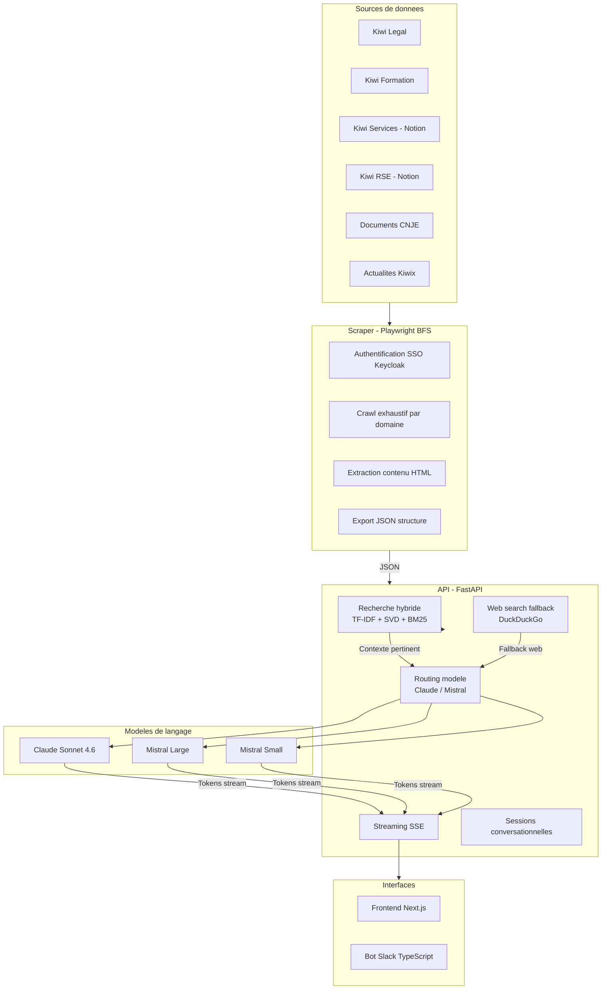
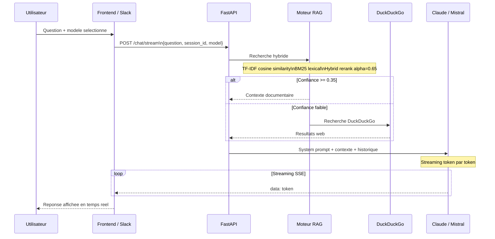
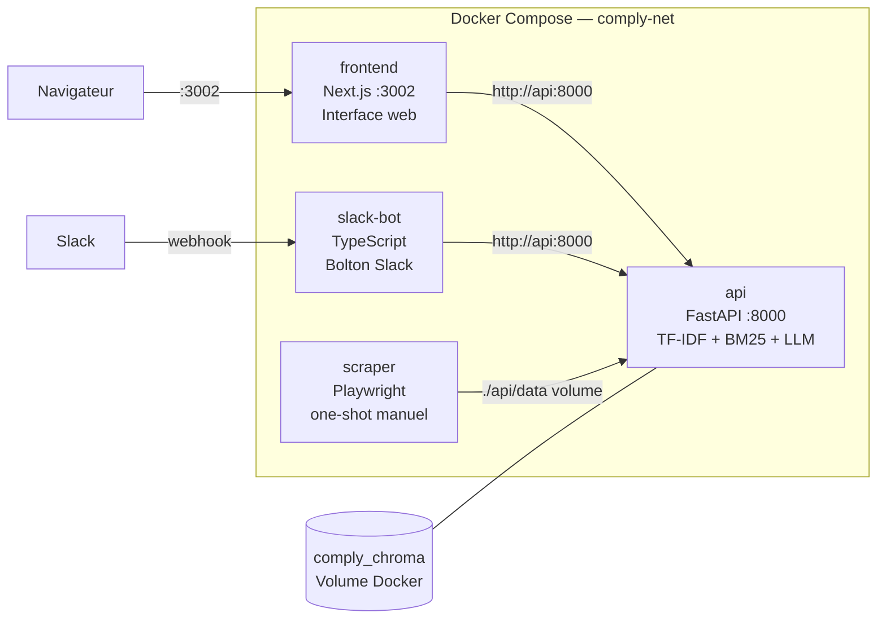
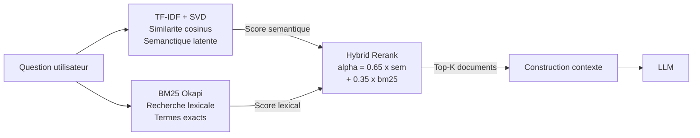
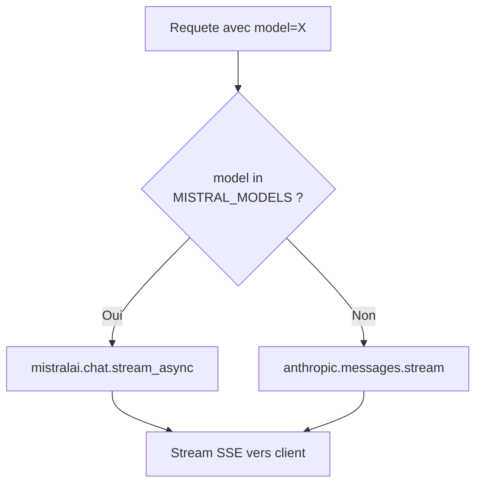
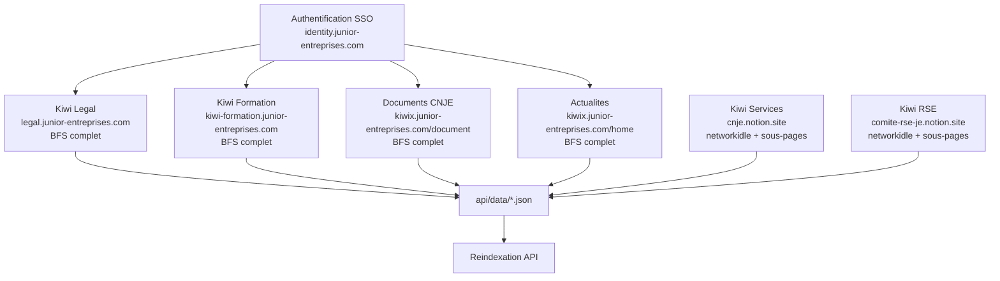

# Comply — Assistant IA pour Junior-Entreprises

Documentation technique — Pôle SI & Performance SEPEFREI, mandat 2025-2026

---

## Sommaire

1. [Presentation](#presentation)
2. [Architecture](#architecture)
3. [Stack technique](#stack-technique)
4. [Fonctionnement](#fonctionnement)
5. [Installation](#installation)
6. [Configuration](#configuration)
7. [Deploiement Docker](#deploiement-docker)
8. [Scraping](#scraping)
9. [Infrastructure recommandee](#infrastructure-recommandee)
10. [Equipe](#equipe)

---

## Presentation

Comply est un assistant IA specialise pour les Junior-Entreprises françaises. Il indexe l'ensemble des ressources de l'ecosysteme Kiwix (documentation juridique, formations, RSE, documents CNJE) et y repond via un moteur de recherche hybride couple a un LLM.

Le systeme est accessible via une interface web et un bot Slack. Il supporte plusieurs modeles de langage (Anthropic Claude, Mistral) selectionnables par l'utilisateur.

---

## Architecture

### Vue d'ensemble



### Pipeline de traitement d'une question



### Architecture des services Docker



---

## Stack technique

### Backend

| Composant | Technologie | Role |
|-----------|-------------|------|
| API | FastAPI 0.115 + Uvicorn | Endpoints REST + streaming SSE |
| Recherche | TF-IDF + TruncatedSVD + BM25 | Recherche hybride semantique + lexicale |
| Persistance | Pickle (.pkl) | Index vectoriel serialise |
| LLM Claude | anthropic >= 0.40 | Appels Claude Sonnet 4.6 |
| LLM Mistral | mistralai >= 1.0 | Appels Mistral Large / Small |
| Web fallback | duckduckgo-search | Recherche web si RAG insuffisant |
| Sessions | Dict en memoire | Historique conversationnel par session |

### Frontend

| Composant | Technologie |
|-----------|-------------|
| Framework | Next.js 14 (App Router, standalone) |
| Style | Tailwind CSS (palette verte #174421 / #246E34) |
| Streaming | EventSource SSE natif |
| Modeles | Selecteur Claude / Mistral Large / Mistral Small |

### Scraper

| Composant | Technologie |
|-----------|-------------|
| Navigateur | Playwright Chromium (headless) |
| Strategie | BFS exhaustif — suit tous les liens internes |
| Auth | SSO Keycloak OpenID Connect |
| Pages Notion | networkidle + 6s wait pour rendu JS |

### Infrastructure

| Composant | Technologie |
|-----------|-------------|
| Orchestration | Docker Compose |
| Bot Slack | TypeScript + @slack/bolt |
| Reseau | Bridge interne comply-net |

---

## Fonctionnement

### Recherche hybride

Le moteur RAG combine deux approches complementaires :



Le coefficient `alpha = 0.65` favorise la recherche semantique tout en conservant la precision lexicale de BM25 pour les termes techniques (RGPD, TVA, statuts...).

### Gestion des sessions

Chaque conversation possede un `session_id` UUID. L'historique (10 derniers echanges) est injecte dans chaque requete LLM, permettant des questions de suivi en contexte.

### Routing multi-modeles

Le modele est selectionne par l'utilisateur dans l'interface et transmis dans chaque requete. L'API route vers Claude (SDK Anthropic) ou Mistral (SDK mistralai) selon le modele reçu.



---

## Installation

### Prerequis

- Docker et Docker Compose
- Python 3.11+ (pour le scraper en local)
- Node.js 20+ (pour le frontend en developpement)

### Variables d'environnement

**`api/.env`** (copier depuis `api/.env.example`) :

```env
CLAUDE_API_KEY=sk-ant-api03-...
MISTRAL_API_KEY=                      # Optionnel — active Mistral
CLAUDE_MODEL=claude-sonnet-4-6
MAX_TOKENS=4096
TEMPERATURE=0.1
DATA_DIR=./data
CHUNK_SIZE=800
CHUNK_OVERLAP=150
MAX_CONTEXT_DOCS=6
MIN_CONFIDENCE=0.35
ENABLE_WEB_SEARCH=true
```

**`slack-bot/.env`** :

```env
SLACK_BOT_TOKEN=xoxb-...
SLACK_SIGNING_SECRET=...
SLACK_APP_TOKEN=xapp-...
API_URL=http://api:8000
```

**`scraper/.env`** :

```env
KIWIX_USERNAME=votre.email@je.fr
KIWIX_PASSWORD=votre_mot_de_passe
OUTPUT_DIR=../api/data
```

---

## Deploiement Docker

### Lancement complet

```bash
docker compose up -d --build
```

Services lances :
- API : `http://localhost:8000`
- Frontend : `http://localhost:3002`

### Commandes utiles

```bash
# Etat des services
docker compose ps

# Logs en temps reel
docker compose logs -f api
docker compose logs -f frontend

# Relancer uniquement l'API
docker compose up -d --build api

# Arreter tout
docker compose down

# Supprimer les volumes (reindexation complete au redemarrage)
docker compose down -v
```

### Sante de l'API

```bash
curl http://localhost:8000/health
# {"status":"ok","rag_ready":true,"documents_indexed":79,...}
```

### Reindexation

Apres un nouveau scraping, declencher la reindexation :

```bash
curl -X POST http://localhost:8000/reindex
```

L'API recharge tous les JSON du dossier `data/` en arriere-plan.

### Activation du bot Slack

Le bot Slack est desactive par defaut (profil Docker). Pour l'activer :

```bash
docker compose --profile slack up -d
```

---

## Scraping

Le scraper parcourt tous les domaines de l'ecosysteme Kiwix en BFS (Breadth-First Search) : il part de la page racine et suit chaque lien interne sans limite de profondeur.

### Lancement local

```bash
cd scraper/
pip install -r requirements.txt
playwright install chromium

python scraper.py --output ../api/data/
```

### Lancement via Docker (one-shot)

```bash
docker compose --profile scraper run --rm scraper
```

### Domaines cibles



Apres un scraping complet, relancer la reindexation via `POST /reindex`.

---

## Infrastructure recommandee

### Specifications

| Composant | Minimum | Recommande |
|-----------|---------|------------|
| CPU | 2 vCores | 4 vCores |
| RAM | 4 GB | 8 GB |
| Stockage | 20 GB SSD | 40 GB SSD |

### Consommation en production

- RAM utilisee : ~2 GB (index ~300 MB + application + OS)
- CPU moyen : 8-12 %
- Cout LLM Claude : ~30-60 EUR/mois selon usage

### Fournisseurs VPS (France)

| Fournisseur | Offre | Prix | Config |
|-------------|-------|------|--------|
| Contabo | Cloud VPS S | 5,36 EUR/mois | 3 vCores, 8 GB RAM, 150 GB SSD |
| Hetzner | CX32 | 6,80 EUR/mois | 4 vCores, 8 GB RAM, 80 GB SSD |
| OVHcloud | VPS Comfort | 4,58 EUR/mois | 4 vCores, 8 GB RAM, 75 GB SSD |

---

## Depannage

### L'API repond 503 au demarrage

Normal : l'indexation se fait en arriere-plan. Attendre 30 a 60 secondes selon la taille des donnees, puis verifier `/health`.

### Le frontend affiche "Erreur de connexion"

Verifier que l'API tourne sur le port 8000 :

```bash
curl http://localhost:8000/health
docker compose ps
```

### Port deja utilise au demarrage

```bash
# Identifier le processus
lsof -i :3002   # macOS/Linux
netstat -ano | findstr :3002  # Windows

# Ou changer le port dans docker-compose.yml
```

### Mistral ne repond pas

Verifier que `MISTRAL_API_KEY` est renseignee dans `api/.env` et que le container a ete rebuide (`docker compose up -d --build api`).

### Reindexer manuellement

```bash
# Via API
curl -X POST http://localhost:8000/reindex

# Ou supprimer le cache et redemarrer
rm api/comply_index.pkl
docker compose restart api
```

---

## Equipe

Develop par le **Pole Systeme d'Information & Performance de SEPEFREI**, mandat 2025-2026.

**Lucas Lantrua** — RAG Engineering, Data Pipeline, Frontend
**Matteo Bonnet** — Backend, API, Bot Slack
**Victoria Breuling** — Product Management, Tests metier

Contact : rsi@sepefrei.fr

---

## Licence

Comply est un projet open-source sous licence MIT.
Developpe par SEPEFREI — Junior-Entreprise de l'EFREI.

Voir [LICENSE](LICENSE) pour les details.

(c) 2025-2026 SEPEFREI
